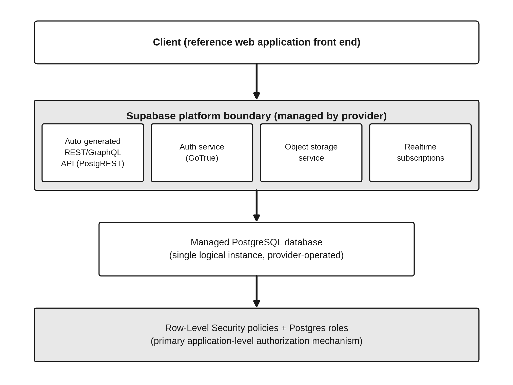
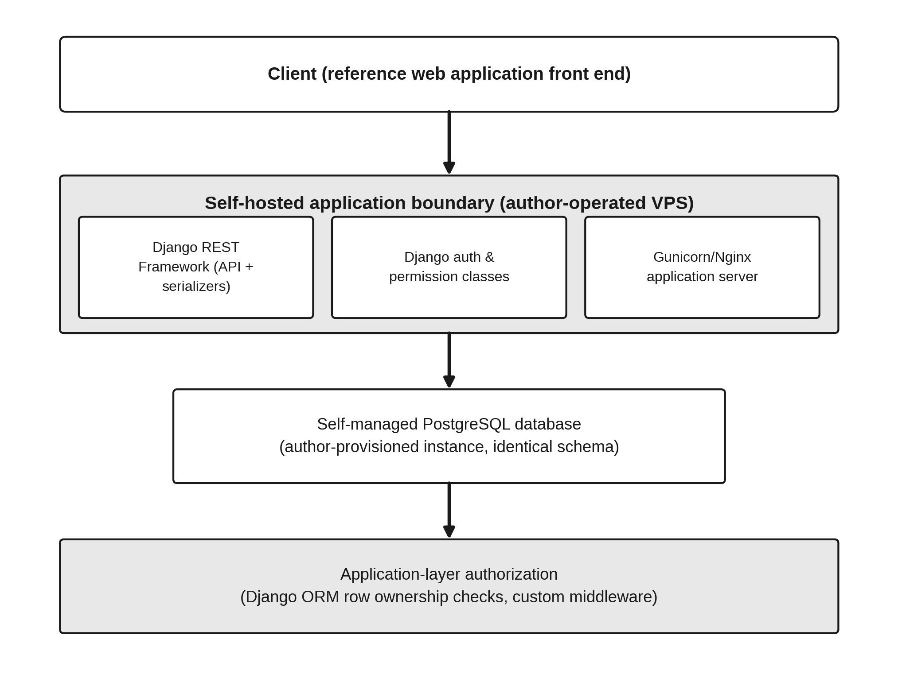
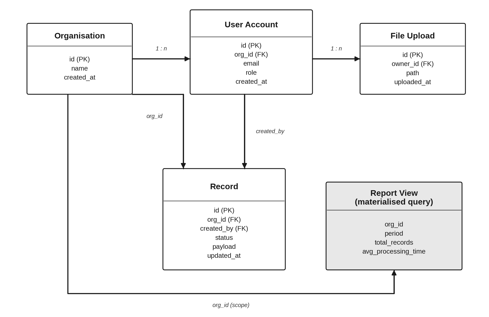
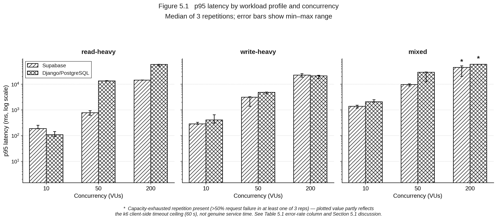
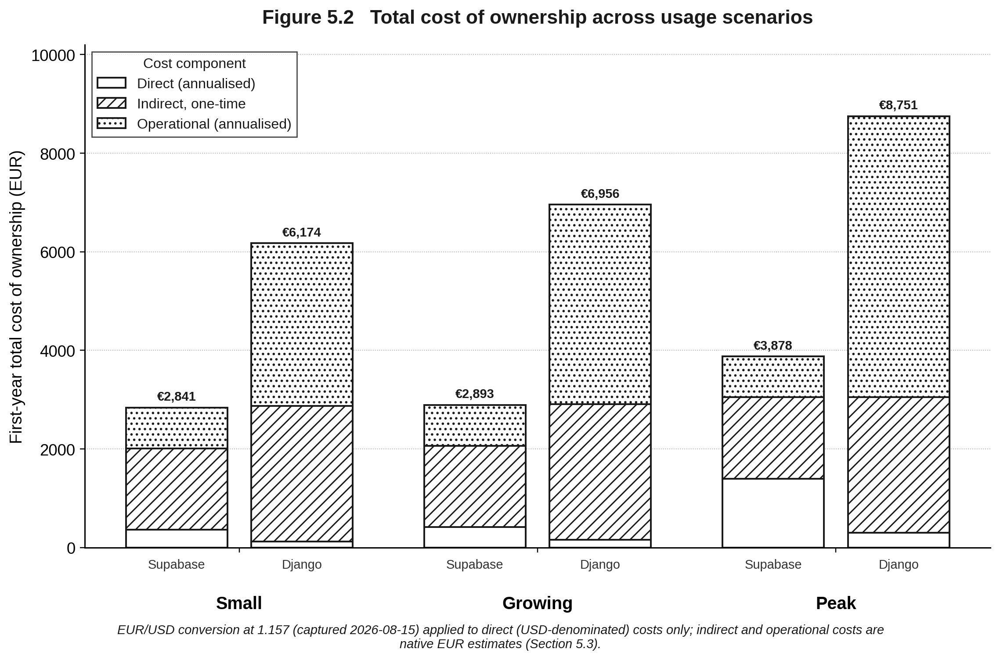
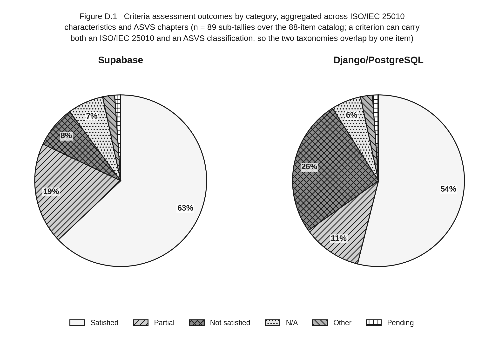

# BaaS vs Self-Hosted — Reference Application

Companion repository to the bachelor thesis **"Backend-as-a-Service versus Self-Hosted Backends: A
Comparative Evaluation of Supabase and Django/PostgreSQL for Small-Business Web Platforms"** (IU
International University of Applied Sciences, Frank Masabo, 2026). It contains both reference
implementations, the benchmark and test tooling, and the raw evidence behind Chapter 5 and
Appendices A–C of the thesis.

## Architecture

Both variants implement the identical schema and expose an equivalent REST surface, but split
enforcement responsibility differently — Supabase pushes authorization down into the database via
Row-Level Security, Django implements it in application code via DRF permission classes.

<table>
<tr>
<th align="center">Supabase (BaaS) variant</th>
<th align="center">Django/PostgreSQL (self-hosted) variant</th>
</tr>
<tr>
<td></td>
<td></td>
</tr>
</table>

## Data model

Both variants apply the same logical schema — Organisation, User Account, Record, File Upload —
through their own migration tooling (Supabase SQL migrations vs. Django's migration framework).

<p align="center"></p>

## Repository structure

| Path | Contents |
|---|---|
| `supabase-variant/` | The Supabase (BaaS) implementation — SQL migrations (schema, RLS policies, auth trigger) under `supabase/migrations/`, plus `supabase/config.toml` for local CLI use. Referenced in Section 4.1. |
| `django-variant/` | The self-hosted Django/PostgreSQL implementation — models, serializers, permission classes, JWT auth, Docker Compose deployment. Referenced in Section 4.2. |
| `shared/data-generator/` | Deterministic synthetic-data generator (fixed random seed) used to seed both variants identically. Section 4.3. |
| `shared/k6/` | The k6 benchmark script exercising both variants' REST APIs under the nine workload/concurrency configurations in Table 3.1. Sections 3.3 / 5.1. |
| `tests/` | Cross-variant API-equivalence tests and adversarial authorization/RLS-bypass tests, run against both variants with the same assertions. Section 5.2. |
| `scripts/` | `set_env.sh` — small helper for writing key/value pairs into a local `.env` without hand-editing it. |
| `results/` | Raw output backing Chapter 5: the 54 k6 JSON summaries (2 variants × 3 workload profiles × 3 concurrency levels × 3 repetitions) behind Table 5.1, `security_tests.xml` (pytest JUnit output, Section 5.2), `criteria_catalog.csv` (the full 88-row scored catalog behind Table 5.2 / Appendix B), `cloc_*.txt` and `coverage_*.txt` (Section 5.4 implementation-effort metrics), and `table_5_1_summary.csv`. |

## Prerequisites

- Python 3.11, Docker and Docker Compose (Django variant)
- [Supabase CLI](https://supabase.com/docs/guides/local-development/cli/getting-started) (Supabase variant)
- [k6](https://k6.io/docs/get-started/installation/) (benchmark)
- A Supabase project (free tier is sufficient) and a VPS or local Docker host for the Django variant

## Setup

Both variants read secrets and configuration from a local `.env` file, which is git-ignored and
never committed. Use `scripts/set_env.sh KEY value` to populate it, or edit it directly.

**Supabase variant**

```bash
cd supabase-variant
supabase link --project-ref <your-project-ref>
supabase db push          # applies migrations 0001-0003 in order
```

**Django variant**

```bash
cd django-variant
cp .env.example .env      # then fill in DJANGO_SECRET_KEY, DB_PASSWORD, GUNICORN_WORKERS, etc.
docker compose run --rm web python manage.py migrate
docker compose up -d
```

`config/settings.py` reads `DJANGO_SECRET_KEY`, `AWS_S3_ENDPOINT_URL`, `AWS_ACCESS_KEY_ID` and
`AWS_SECRET_ACCESS_KEY` from the environment; a fresh checkout will run without them, but
file-upload endpoints won't work until real object-storage credentials are set.

**Seed identical synthetic data into both**

```bash
python shared/data-generator/seed.py --scenario small   # or growing / peak, matching Table 3.3
```

## Running the tests and benchmark

```bash
cd tests && pytest test_equivalence.py test_authorization.py -v --junitxml=../results/security_tests.xml
docker compose -f django-variant/docker-compose.yml run --rm web python manage.py test core

k6 run --summary-export=results/<target>_<profile>_<vus>_rep<n>.json \
  -e BASE_URL="$BASE_URL" -e AUTH_TOKEN="$AUTH_TOKEN" -e PROFILE=<profile> -e VUS=<vus> \
  shared/k6/workload.js
```

See `Platform_Build_Guide.md` (in the thesis repository) for the full annotated walkthrough this
was built from, including exact credential-retrieval and JWT-minting steps for both variants.

## Results at a glance

Full analysis is in Chapter 5 of the thesis; these are the headline charts, generated from the raw
files in `results/`.

<p align="center">
  
  <br/><sub>p95 latency per workload profile and concurrency level (Table 5.1 → Figure 5.1). Django is
  faster at low concurrency; Supabase is more consistent at high concurrency and under the mixed
  workload's reporting-query load.</sub>
</p>

<table>
<tr>
<td width="55%"><br/><sub>Total cost of
ownership across usage scenarios (Table 5.3 → Figure 5.2). Django is cheaper on direct
infrastructure cost alone; Supabase is cheaper once implementation and operational effort are
included.</sub></td>
<td width="45%"><br/><sub>Criteria
catalog outcomes by architecture, aggregated across the 88-item catalog (Table 5.2 → Appendix
D.1).</sub></td>
</tr>
</table>

## Reproducibility notes

- Pricing figures behind Appendix C / Table 5.3 were captured as dated screenshots on 2026-08-15
  and are not reproducible from this repository alone — provider pricing changes over time (see
  Section 6.3's limitations discussion).
- The k6 result files in `results/` are the three raw repetitions per configuration; Table 5.1
  reports the min–max range across them, not a single point estimate, since several
  high-concurrency configurations show substantial inter-repetition variance (documented in
  Section 5.1 and `Defense_Arguments.md`).
- Both variants are seeded from the same fixed random seed (`shared/data-generator/seed.py`), so
  re-running the seed step reproduces identical Organisation/User/Record/File Upload rows on both
  sides.

## Security note

This is a benchmark/research reference application, not a production service — `DEBUG = True` and
`ALLOWED_HOSTS = []` in `django-variant/config/settings.py` are intentional for local
benchmarking and are not safe defaults for a real deployment. No live credentials are committed to
this repository; `DJANGO_SECRET_KEY` and object-storage keys must be supplied via environment
variables (see Setup above).

## License

MIT — see `LICENSE`. Thesis text and figures are not covered by this license; see the thesis
document itself for citation terms.
